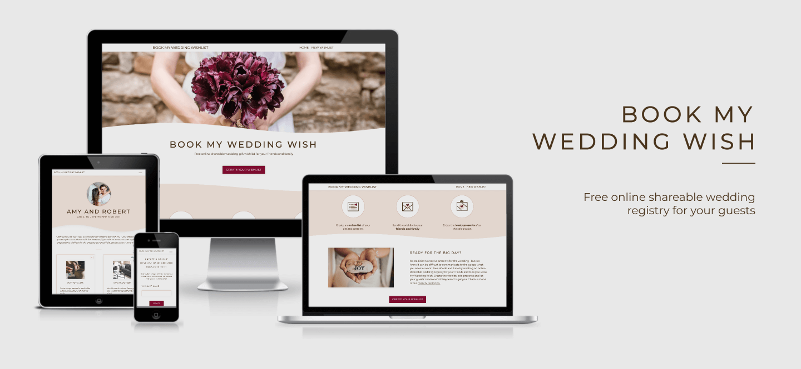
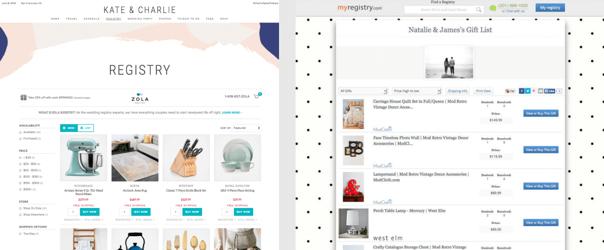
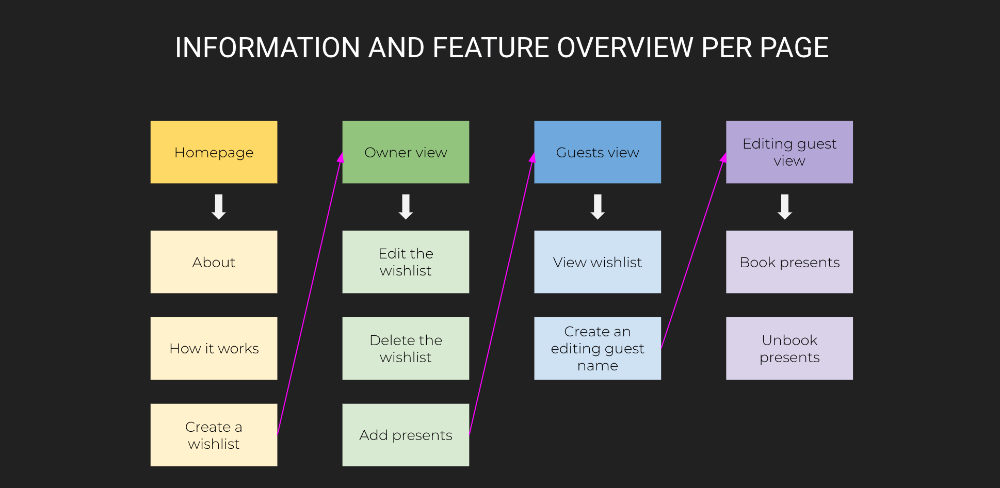
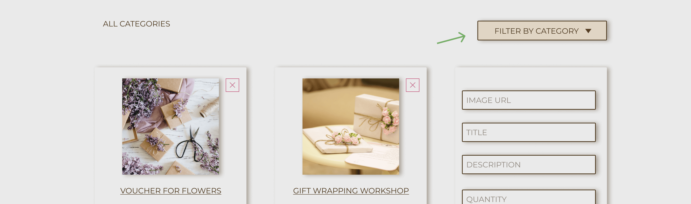
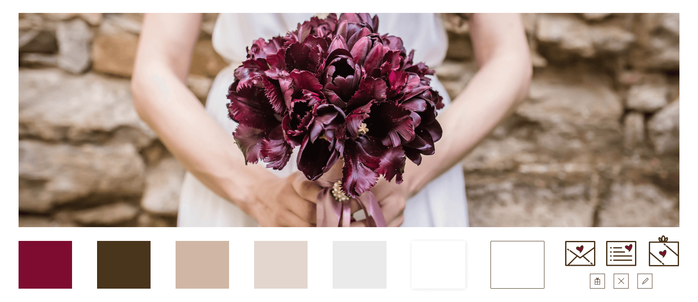

# BOOK MY WEDDING WISH - Online Wedding Registry For Your Guests

Code Institute - Milestone Project 3 - Data Centric Development

BOOK MY WEDDING WISH helps you create your dream wedding registry for your friends and family.
Since it can be difficult, and often awkward, to communicate to your guests what you need or would like to receive,
Book My Wedding Wish allows you to create an online gift wishlist that you can share with your guests - for free.

The primary purpose of this web app is to help the soon-to-be married couple with informing their wedding attendees what they 
would prefer to receive as presents. Instead of talking to each guest separately, struggling with giving present suggestions 
that would fit a guest's budget, getting the same present twice or end up not liking a present at all - Book My Wedding Wish 
aims to help the happy couple by allowing them to create an online place where guests can choose among the presents the couple wishes
to receive.

As the guests also struggle with choosing a present for the newlyweds - which is often quite expensive - this online 
wedding gift wishlist helps them with deciding on what to buy while they can be sure the present will be greatly appreciated. 
Therefore, the secondary purpose of this app is to provide a simple overview of desired wedding presents and an easy booking process.

## UX

It is no secret wedding planning can be quite stressful and time-consuming. According to [Zola's survey](https://www.zola.com/blog/wedding-planning/science-wedding-planning-stressful/) 
on wedding planning, 96% of couples find wedding planning stressful. In fact, 86% of respondents suffered from up to three stress-induced symptoms, 
including skin breakouts, hair loss, insomnia, headaches, etc. On the other hand, 
[DailyMail](https://www.dailymail.co.uk/femail/article-2394473/Thats-ungrateful-82-PER-CENT-newlyweds-admit-selling-wedding-gifts-eBay.html) 
reports that "42% of guests admit they find buying wedding gifts stressful" while 10% of invited guests "declined invitation due to finding 
gift-buying process unpleasant." Despite the effort guests put into choosing a present, DailyMail's research has also shown that 20% of guests 
expect their gifts to be left unused, returned or sold while 82% of newlyweds actually do end up selling their presents on eBay and similar sites.

The psychology of giving wedding gifts is truly fascinating. In NPR's [interview with Shankar Vedantam](https://www.npr.org/2016/06/24/483426485/new-study-explores-psychology-of-giving-wedding-gifts?t=1599418748672), 
who did a research on this topic, Shankar says the tensions are produced from the fact that we want the gift to please the people getting married but 
at the same time, the gift should reflect well on us. One of the reasons why guests deviate from buying off the wedding registry is that it doesn't 
feel special enough. It is the close friends that normally deviate from the registry, saying that "they're doing it because they know what we really 
want more than we know ourselves." It doesn't seem like those 82% newlyweds who end up selling their wedding presents on eBay would agree.

### Conclusion of the Research

For a life event that is expected to be full of joy and harmony, the research shows otherwise for majority of the participants - newlyweds and guests both.
The wedding planning is already stressful enough and the research shows the happy couple doesn't seem to be as happy with the presents despite the 
availability of wedding registries. This project follows the general UX of other online wedding registries such as [MyRegistry](https://www.myregistry.com/) 
and [Zola](https://www.zola.com/) with an important twist - a present is submitted with a personal note from the couple explaining why they want 
exactly this present. This might help the guests to realise the importance of the item on the list and encourage them to stick to the list.

### Customer Goals

The primary customers for this app are the wishlist owners, however, since guests are interacting with the wishlist as well, they can be considered as 
the secondary customers.

As a wishlist owner...

* I need to communicate well to my guests which presents I'd like to receive so that I don't get something I don't want or need.
* I want to save my gift wishlist online so that I can easily share it with the guests.
* I want to be able to see which gifts will be bought so that I can add more if I have to.
* I want to have control over the presents I put on the wishlist so that I know the guests have the updated list.
* I want to be able to add a personal message to each present so the guests know why I want that particular present.
* I want to have a variety of presents on the wishlist so that everyone can pick something it fits their budget best.

As a wedding guest...

* I need help with deciding what to buy to the happy couple because the buying process is stressful for me.
* I need to be sure the couple will love the present I buy so that I don't feel like I've wasted my money.
* I want to know that other guests will not buy the same product so that the couple doesn't get the same present twice.
* I want to buy a present that I am also happy with so that I feel like I'm giving something unique or special.

### Business Goals

This project is mostly focusing on the end-user needs, such as wishlist owners and their wedding guests, since the main goal was to make sure the web app is 
suitable and useful for them. However, the business idea for this app could follow the affiliate business model most online wedding registries follow. 
The features related to business goals can be implemented in the future product releases.

As a business owner...

* I want to be able to analyse what users are buying, so I can earn by selling data to 3rd parties.
* I want to see which brands people are buying from so that I could start brand partnership with them.
* I want the user to have an interface they will love because they will want to come back.
* I want the users to be able to connect to the product online so that the chances of buying the item and earning from its comission are increased.

## Features and App Sections

As this project relies on backend technologies more than my previous projects, my process for defining features and information architecture was different. 
I've started with listing the actions that the users should be able to do with this app - first wishlist owners and then their wedding guests. This also meant that 
different types of users, owners and the guests, should have different page views. Finally, I didn't want this project to be accessible to only logged in or signed in 
website visitors because I've often felt discouraged to proceed to explore projects from the others that required me to give them my personal details like my email 
address or having to create passwords to remember how to access my account. Therefore, I had to be sure the features are grouped per user type and reflected well 
on the website structure as well as having an easy way to come back to the submitted information.

As a result, I prepared this short overview of what each website section should be able to do or provide, which was my main guide when working on the app. This is how 
the MVP was created.

### App Sections

1. **Navigation on the top** - fixed navigation on the top which differs to different user type so that the users have shortcuts to the main functions of the particular 
page view (edit present, edit wishlist, delete wishlist, etc.) and are able to navigate themselves back to the homepage if needed.
1. **Header** - introduction to the website or to the wishlist - different to different user type with the appropriate information in the header.
1. **Homepage USP section** - a quick overview of the steps how the app works.
1. **Homepage about section** - rather than speaking about the project itself, this small textual section addresses users' pain points and introduces Book My Wedding Wish as a solution to their problems.
1. **Owner view** - a set of pages where the wishlist owners can add presents to their list, update and delete the wishlist and the products and link to the guest view.
1. **Guest view** - a set of pages where the first time guest visitor can submit their username to book and unbook the presents they want to buy.
1. **Footer** - gives users the option to stay up to date with the app via links to social media profiles.

### Features

The features are split into owner-related features and guest-related features, although, every owner can also be a guest and vice versa.

Owner features:

1. **Unique wishlist creation** - a feature that allows users to create their wishlists by submitting a unique wishlist name. The app validates the submitted name and encourages a new 
one if needed. It is important the name is unique because it appears in the link to the wishlist. The name cannot be edited afterwards - thought the owner has the possibility to delete 
the whole wishlist and create a new one if needed.
1. **Additional wishlist information** - a feature that lets the wishlist owners customise their wishlist preview by adding wishlist description, header image, wedding details and customize 
the header colour of the wishlist (i.e. choosing the wishlist theme).
1. **Add presents to the list** - a feature that lets the owners add presents to the list. The older presents appear at the top of the page.
1. **Edit presents** - a feature that allows the owners to edit a submitted present's details.
1. **Delete presents** - a feature that allows the owners delete the presents they don't want to have on the list.
1. **Edit wishlist** - a feature that allows the owners to edit wishlist information. The wishlist name and the theme are not editable. Name can't be edited to preserve the uniqueness 
of the shareable link. Wishlist theme editing has been explained in the future features below.
1. **Delete wishlist** - a feature that allows the owners delete the wishlist.

Guest features:

1. **Submit username** - a feature that lets the user register to the wishlist with their name. An important step to be able to reserve the presents.
1. **Book a present** - a feature that allows registered guests to reserve the presents.
1. **Unbook a present** - allows registered guests to unbook the presents they have previously reserved.

### Features Left to Implement

1. **Category filter** - even though it was originally planned - unfortunately, I didn't have enough time to implement this feature that would allow the owners and the guests filter out 
the presents by category and perhaps additionally whether the present is available or not, etc.

2. **Edit wishlist theme** - as mentioned in the previous section above, currently the wishlist owners can't change the wishlist theme. This feature has also been postponed due to lack 
of time - I have implemented the wishlist theme feature too late in the process and since it's based on submitting data through radio buttons, I simply ran out of time to find an appropriate 
solution for getting this information back and displaying it again in the form of radio buttons.

3. **Owner's statistics overview** - another useful feature would be a dashboard for the owners. It could be as detailed as being able to see how many presents have been booked per user, 
per category, per date, etc. - or it can be as simple as the short overview below.

4. **Broken image placeholder** - this feature was originally planned but hasn't been prioritised. At the moment, the user can submit any kind of URL in the forms instead of links to the images 
for wishlist header image and present images. It would be great to have a placeholder image that appears in case the image link gets broken. Alternatively, the owners would be able to upload the 
images themselves instead of linking.

5. **Recommendation system for owners** - since the app could potentially store a lot of data about the presents submitted in various wishlists, an additional feature that could help save time and 
efforts could be recommendation system for the owners. The system would analyse which presents, brands and present categories have been most wanted lately by the soon-to-be married couples. 

6. **Affiliate links or direct purchase on BMWL** - at last, a business-related feature that should help with scaling up the MVP into a profitable product. A simple idea would be to implement 
a list of products with affiliate links behind them and let the owners browse through the presents on the site with the option of submitting presents that are missing. A step further would be to integrate 
with an ecommerce system like [Tipser](https://tipser.co/en/) so the guests can order presents at once directly from BMWL.

### Wireframes

The wireframes can be found at the links below:

Desktop:
* [Desktop homepage wireframe](https://github.com/valentina-b/book-my-wedding-wish/blob/master/readme-files/images/wireframes/img-wireframe-dsk-hp.png)
* [Desktop owner view wireframe](https://github.com/valentina-b/book-my-wedding-wish/blob/master/readme-files/images/wireframes/img-wireframe-dsk-owner-view.png)
* [Desktop owner view popup message wireframe](https://github.com/valentina-b/book-my-wedding-wish/blob/master/readme-files/images/wireframes/img-wireframe-dsk-owner-view-popup.png)
* [Desktop guest view wireframe](https://github.com/valentina-b/book-my-wedding-wish/blob/master/readme-files/images/wireframes/img-wireframe-dsk-guest-view.png)

Tablet:
* [Tablet homepage wireframe](https://github.com/valentina-b/book-my-wedding-wish/blob/master/readme-files/images/wireframes/img-wireframe-tab-hp.png)
* [Tablet owner view wireframe](https://github.com/valentina-b/book-my-wedding-wish/blob/master/readme-files/images/wireframes/img-wireframe-tab-owner-view.png)
* [Tablet owner view popup message wireframe](https://github.com/valentina-b/book-my-wedding-wish/blob/master/readme-files/images/wireframes/img-wireframe-tab-owner-view-popup.png)
* [Tablet guest view wireframe](https://github.com/valentina-b/book-my-wedding-wish/blob/master/readme-files/images/wireframes/img-wireframe-tab-guest-view.png)

Mobile:
* [Mobile homepage wireframe](https://github.com/valentina-b/book-my-wedding-wish/blob/master/readme-files/images/wireframes/img-wireframe-mob-hp.png)
* [Mobile owner view wireframe](https://github.com/valentina-b/book-my-wedding-wish/blob/master/readme-files/images/wireframes/img-wireframe-mob-owner-view.png)
* [Mobile owner view popup message wireframe](https://github.com/valentina-b/book-my-wedding-wish/blob/master/readme-files/images/wireframes/img-wireframe-mob-owner-view-popup.png)
* [Mobile guest view wireframe](https://github.com/valentina-b/book-my-wedding-wish/blob/master/readme-files/images/wireframes/img-wireframe-mob-guest-view.png)

## Graphic Design and Brand Elements

Book My Wedding Wish is imagined to be a non-commercial, customisable online space whose look-and-feel is inspired by traditional western wedding ambience. The major inspirations for the app were 
[Zola](https://www.zola.com/), [TheKnot](https://www.theknot.com/) and [MyRegistry](https://www.myregistry.com/). The UI follows clean design principles intertwined with traditional-looking elements, 
such as sharp edges and earthy colours, to symbolise the modern approach to a traditional topic. 

Although I did my best to be as neutral as possible with choosing the fonts, colours and general design approach, I'm aware that this web app might be more appealing to the female audience rather than 
the male audience. I have also tried to be respectful of different religious orientations by avoiding religious symbols and indications. That being said, I felt that it's difficult to represent a wedding-related 
topic in design without following some kind of widely-spread association to weddings. I will elaborate this more in the next sections.

### Fonts

Originally I have planned to have a mix of a modern, web-friendly font and a handwritten, i.e. cursive, font. The cursive font was supposed to give the personal touch to the app, just as if 
someone would go the extra mile to write something themselves - what you normally see in wedding invitations and wedding favours. However, as I was working on the design, I've felt that the app 
itself already gives enough ways of personalising the wishlists to feel personal to the guests and a handwritten font might evoke unnecessary luxuriousness.

The font I've used for the app is [Montserrat](https://fonts.google.com/specimen/Montserrat), a font that I personally consider to be semi-formal and well-suited for topics such as weddings. I have customised 
it by changing the line height, letter spacing and weight of the font. All the headings are also in uppercase form to look more elegant.

### Colours

The inspiration for the colour palette comes from the header image which I've found on [Unsplash](https://unsplash.com/). My colour selection consists of earthy light and dark colours. The lighter colours have been 
used for the background, borders of the elements that shouldn't be overly accentuated, such as present cards, and subtle section dividers like lines.

The font is in the darker shade of brown instead of pure black to make the reading more pleasant to the eyes but also to evoke the warm, earthy feeling of harmony. This darker shade of brown and wine red colour 
have been used as accent colours for the CTAs, borders and actively selected elements.

### Images

The wedding ambience has also been expressed through the images. As mentioned in the introduction section above, I felt that it's difficult to represent a wedding-related topic in design without following some kind of 
widely-spread association to weddings. For me that meant white wedding dress, flowers and bridal bouquets, rings and hearts. This could also be done differently - for example, [TheKnot](https://www.theknot.com/) 
decided to feature in their header video clips of a Christian wedding, a Hindu wedding, etc. to be more inclusive.

### Visual Style

Once the font, colour palette and images were selected, I've focused on the design of the elements. I wanted the app to look professional and presentable but at the same harmonious and balanced.

Since my goal was to achieve a mix of modern and traditional look, the elements such as buttons, input fields, present cards, icons, etc. are with slightly rounded or sharp edges. The shadows are light and often barely 
noticeable. Visual identity in general is heavily relying on a combination of pastel colours with their darker shades and elegant font style. There are no additional decorations apart from the simple lines that help out 
with breaking down the sections for easier information grasping.

All the icons were also custom-made by me to fit the concept best - except for the social media icons.

## Technologies Used

This project mostly focuses on the following technologies:

1. [HTML](https://en.wikipedia.org/wiki/HTML) - for creating the layout and the structure of the website
1. [CSS](https://en.wikipedia.org/wiki/Cascading_Style_Sheets) - for styling the website’s HTML code
1. [Bootstrap](https://getbootstrap.com/) - for additional styling and adding responsiveness to the website
1. [JavaScript](https://en.wikipedia.org/wiki/JavaScript) and [jQuery](https://jquery.com/) - for collapsing the Bootstrap's burger menu
1. [Python](https://en.wikipedia.org/wiki/Python_(programming_language)) and [Flask](https://en.wikipedia.org/wiki/Flask_(web_framework)) - for backed logic and structure
1. [MongoDB](https://en.wikipedia.org/wiki/MongoDB) - for storing data in a database
1. [Git](https://git-scm.com/) - for version control

Technology used that is connected to [Bootstrap](https://getbootstrap.com/) for some components to function properly:

1. [jQuery](https://jquery.com/)
1. [Popper.js](https://popper.js.org/)
1. [JavaScript](https://en.wikipedia.org/wiki/JavaScript)

Additionally, I have also used the following platforms to help me shape the website and the brand:

1. [Gitpod](https://gitpod.io/) - for writing, editing and live previewing the code during the creation process
1. [GitHub](https://github.com/) - for hosting the project's repository and creating a preview link on GitHub pages
1. [TinyPNG](https://tinypng.com/) - for compressing the images so that the website can load faster
1. [Google Fonts](https://fonts.google.com/) - for selecting the fonts and implementing them into the HTML code
1. [Figma](https://www.figma.com/) - for creating wireframes, web designs and icons
1. [Favicon](https://favicon.io/) - for creating browser tab icons

## Testing

The project's code was frequently validated through:
* [W3 HTML validator](https://validator.w3.org/nu/)
* [W3 CSS validator](http://www.css-validator.org/)

The web app was tested on the devices and browsers listed below. I loaded the page on each of the device and browser combination and looked for any visual and functional errors. I've also tried to resize the webpages on 
desktop in Chrome, Firefox, Opera and Safari developer tools to look for hidden irregularities and finding out the solutions. More about the errors I've encountered can be found under the 'Bugs and Problems'.

Desktop:

1. Acer
  * Google Chrome
  * Internet Explorer
  * Firefox
2. MacBook
  * Google Chrome
  * Safari
  * Opera
  * Firefox

Mobile:

1. iPhone 8
  * Safari
2. HTC
  * Google Chrome

### Testing the Features

Owner features:

* Unique wishlist creation
  1. Visit the homepage.
  1. Click on 'Create your wishlist' button, 'New wishlist' navigation link or scroll to the bottom of the page.
  1. Submit a unique wishlist name.
  1. The feature works if you have been redirected to complete the wishlist information or to an error page that will ask you to submit another name since submitted one has already been taken.

* Additional wishlist information
  1. Submit a unique wishlist name.
  1. Complete the wishlist with additional information.
  1. The feature works if you have been redirected to the owner view with the correct information displayed on the page (title, wedding details, colour theme, header image etc.).

* Add presents to the list
  1. Visit the owner view page.
  1. Scroll to the bottom of the page.
  1. Use the present form to submit presents.
  1. The feature works if after submitting the present information you're redirected to the same owner view page with the present displayed on the page.

* Edit presents
  1. Visit the owner view page.
  1. Click on a pencil (edit) icon at the right corner of the present description (present card).
  1. Once you are redirected to the edit page, edit the present information and submit it.
  1. The feature works if you have been successfully redirected to the edit present page and were able to submit the edited information.
  1. You should expect to be redirected to the owner page and see your present edited.

* Delete presents
  1. Visit the owner view page.
  1. Click on the X (delete) icon at the right corner of the present description (present card).
  1. You should expect a popup to open and ask you to confirm the action.
  1. Click on 'Delete' hyperlink.
  1. The feature works if you have been successfully redirected to the owner view page and the deleted present is gone.

* Edit wishlist
  1. Visit the owner view page.
  1. Click on the 'Edit wishlist' hyperlink in the navigation or bottom of the page.
  1. Once you are redirected to the edit page, edit the wishlist information and submit it.
  1. The feature works if you have been successfully redirected to the edit wishlist page and were able to submit the edited information.
  1. You should expect to be redirected to the owner page and see your wishlist information edited.

* Delete wishlist
  1. Visit the owner view page.
  1. Click on the 'Delete wishlist' hyperlink in the navigation or bottom of the page.
  1. You should expect a popup to open and ask you to confirm the action.
  1. Click on 'Delete' hyperlink.
  1. The feature works if you have been successfully redirected to the Thank You page and you can't access the owner view page anymore.

Guest features:

* Submit username
  1. Visit the guest view page.
  1. Scroll to the bottom of the page and submit your name and surname
  1. The feature works if you have been redirected to the registered guest view and you are able to book and unbook presents.

* Book a present
  1. Visit the guest view page.
  1. Click on the 'Book me!' hyperlink at the right corner of the present description (present card).
  1. The feature works if you have been redirected to the registered guest view and the present is reserved under your username.

* Unbook a present
  1. Visit the guest view page.
  1. Click on the X (delete) icon at the right corner of the present description (present card).
  1. You should expect a popup to open and ask you to confirm the action.
  1. Click on 'Unbook' hyperlink.
  1. The feature works if you have been redirected to the registered guest view and the present previously reserved under your username is now available again.

### Bugs, Problems and Vulnerabilities

**Linking logic and structure issues**

Since this app doesn't require authentication to access the information, the app can be manipulated through URL structure. This makes the app quite vulnerable in general. In order to expose the vulnerabilities, a short overview of the linking logic 
and information passed through the URLs might be helpful.

When a wishlist name is created, it is converted to lower case and the spaces are replaced with hyphens. For example, 'Amy and Robert' will be turned into `amy-and-robert`. This is then stored as a unique wishlist name which is used in the URLs linking to 
the owner and guest views. The owner view adds `/owner` to the URL containing the wishlist name, such as `www.domain.com/amy-and-robert/owner`. An unregistered guest accesses the wishlist by adding `/guest` to the URL, such as `www.domain.com/amy-and-robert/guest`.
A registered guest will have to add their submitted name and surname in lower case with space between them like so - `www.domain.com/amy-and-robert/guest/ashley-smith`.

This logic is great for accessing your information again and makes the links look more pleasant than having a bunch of id numbers in them. However, this also means that - whoever has the guest view can also manipulate the link to access owner page view and edit the data.

This also means that someone could type in different values in the URL and reach error pages. I have tried to avoid this by redirecting a non existing owner view and guest view to the homepage, although I believe it can be done better and more detailed in the future.

**Page refreshing**

If there are multiple registered guests on the page, they can book each others' presents. This happens because the page is not refreshing itself so the data is not always displayed updated in real time. If two guests open their registered guest views at the same time, 
one books a present - the other one will still have the active 'Book me!' link on his page view. By clicking on the link, he can override the booking of the first guest.

**Editing present that is booked**

The owners in their views have also displayed information about whether the present has been booked or not. If they want to edit the present - for example exchange the image or change the price - the booking information will not be removed. I was thinking what 
would generally be a better user experience regarding that. Should the guest see their name has been removed - or should they keep the reserved present while the price might have jumped from €80 to €300. As in my opinion it might be too confusing to 
see your name has been removed for some reason and the unbooking process is fairly easy, I have decided not to update the b=present back to being available. This also might have some other solutions, like removing the booked presents from the guest view pages.

**Discovered cross-browser issues:**

* Styling form elements such as buttons, `textarea` and `select` tags required additional CSS solutions and efforts - solved!
* Height and width values such as `fit-content` were problematic on Safari and Firefox browsers - solved!
* SVGs displaying images via `clipPath` solution were invisible in Safari desktop browser. I haven't dived deeper into finding the SVG-related solution due to lack of time, so I've solved this by exchanging images with PNG files - solved, but can be improved!
* Smooth scrolling (`html {scroll-behavior: smooth;}`) doesn't work in Internet Explorer and Safari - not solved.
* When a user is filling in and submitting a form in Safari mobile browser, the view zooms in on click and stays that way unless the user doesn't zoom out. Can be a bit annoying if the user decides not to finish the form and scroll away - not solved.
* Although the app works perfectly fine in Internet Explorer on my Acer, the UI is completely distorted. The buttons are without styling, links are all blue, navigation bar is transparent, present cards are transparent, images don't fit their sizes, etc. - not solved.

**Other important remarks:**

* I'm so grateful to my mentor who has recommended adding comments with [PyDoc](https://docs.python.org/2/library/pydoc.html) to my Python code but I, unfortunately, ran out of time and had to prioritise different things. 
I did my best to have clear and easy to follow comments in the code instead and will try to implement the comments properly in the future from the start!

## Deployment

### GitHub Pages

To deploy a website on GitHub Pages, follow these steps:

1. Go to the repository page
1. Click on settings icon in the top of the page
1. Find "GitHub Pages" section
1. Click on the "Source" dropdown menu
1. Select "master branch" option
1. A green success message should appear in the "GitHub Pages" section with the link to the live preview of the project.

For more information please visit [here.](https://help.github.com/en/github/working-with-github-pages/configuring-a-publishing-source-for-your-github-pages-site)
In my case I have added a .gitignore file to the project with env.py file in it. In the env.py I have put MongoDB URI which allows me to connect to my database and interact with it.

### Local Deployment

To create a local copy of a repository, follow these steps:

1. Go to the repository page
1. Click on the "Clone or download" button in the top of the page
1. Click the check list icon on the right of the newly opened window to clone the repository using HTTPS
1. Open Terminal
1. Change the current working directory to the location where you want the cloned directory to be made
1. Type "git clone" and paste the URL you copied in step 3 and run the command

For more information please visit [here.](https://help.github.com/en/github/creating-cloning-and-archiving-repositories/cloning-a-repository)
You will need the connection to the database and install packages from the provided requirements.txt file.

### Heroku deployment

To deploy a project on Heroku, follow these steps:

1. Set up a Heroku account at [Heroku](https://www.heroku.com/)
1. Click on "New" button and select "Create new app"
1. Add a unique name and select your region (for example Europe)
1. In your "Settings" tab add config vars if needed
1. Go back to your terminal and log in to your heroku account by entering `heroku login -i`
1. Submit your login details
1. In the terminal enter `heroku git:remote -a your-heroku-app` to link to the app
1. Deploy the project to Heroku by entering `git push heroku master`

For more information please visit [here.](https://devcenter.heroku.com/start)

## Lessons Learned

My favourite part of writing this documentation is looking back and self-reflect on my progress since the previous project. Besides obviously learning Python and Flask from scratch and learning how to use MongoDB and Heroku, there has been numerous other small wins 
and achievements throughout the process. Here are some points I wanted to highlight:

* Getting familiarised with Bootstrap classes and components definitely pays off! I have already noticed that during my previous project when I started to use Bootstrap for more than just columns and rows. This time I focused more on the form elements and styles while continuing 
to use text- and display-related classes such as `text-uppercase`, `text-center`, `d-none`.
* Creativity with using SVGs is unlimited! I have learned so much about creating and using SVG codes instead of uploading images and bothering with styling `div` elements. 
* Backend-first way of thinking is much more logical than frontend-first approach - in my humble opinion at least! It took me some time to shift the mindset that I have to know beforehand what I'm trying to achieve with this project and start planing it before having a 
first project draft done. It's been very exciting exploring different solutions and feature options before being able to see the app.
* I know it's old for many - but I've literally discovered just a few days ago that other browsers, not just Chrome, also have inspect element functions! I also dived into solving cross-browser issues and getting familiar with why different browsers display things differently.
* Styling radio buttons is a skill on it's own! I would have never figured this out without additional help online. It took me a lot of time and efforts to figure out the logic of styling them but I did it and you can see the results live.

## Credits

### Content

* The content for this web app is completely original, written by me.

### Media

* The homepage photos, including header and footer images on the other pages, were downloaded from [Unsplash](https://unsplash.com/).
* The images submitted through a link come from various sources, mostly [Unsplash](https://unsplash.com/) and [Google](https://www.google.com/).
* Social media icons were downloaded from [Flaticon](https://www.flaticon.com/).
* All other icons were created by me in [Figma](https://www.figma.com/).
* The product showcase image was taken with the help of [Ami.ResponsiveDesign](http://ami.responsivedesign.is/).
* I've also went through design projects on [Dribbble](https://dribbble.com/) to get inspired about the app layout.

### Coding Sources

* Helped me understand how to [connect Bootstrap modal with Flask and MongoDB](https://stackoverflow.com/questions/60623203/modal-in-flask-displays-only-the-first-record).
* Helped me understand [how to style `select` tags with CSS](https://stackoverflow.com/questions/14218307/select-arrow-style-change).
* Helped me understand [how to remove glossy effect for `select` tags in Safari](https://stackoverflow.com/questions/7638677/how-can-i-remove-the-gloss-on-a-select-element-in-safari-on-mac).
* Helped me create [collapsible burger menu](https://stackoverflow.com/questions/42401606/how-to-hide-collapsible-bootstrap-4-navbar-on-click?rq=1).
* Helped me with [styling radio buttons](https://stackoverflow.com/questions/8287779/how-to-use-the-required-attribute-with-a-radio-input-field) - the credits are also in my HTML and CSS files.
* Helped me with [adding filters to images](https://css-tricks.com/almanac/properties/f/filter/).

### Acknowledgments

* Once again - a huge and warm thank you to my mentor [Dick Vlaanderen](https://github.com/dickvla) who has been my biggest source of encouragement and inspiration throughout my coding journey - your support and direction have been a huge confidence boost 
as well as comfort throughout the whole process! Thank you for all your kind words and the help!
* Thank you [CodeInstitute's](https://codeinstitute.net/) Tutors and Slack community for being there for annoying little bug questions!